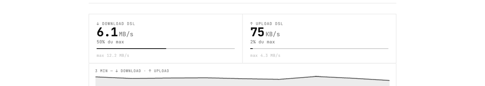
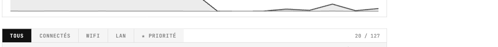
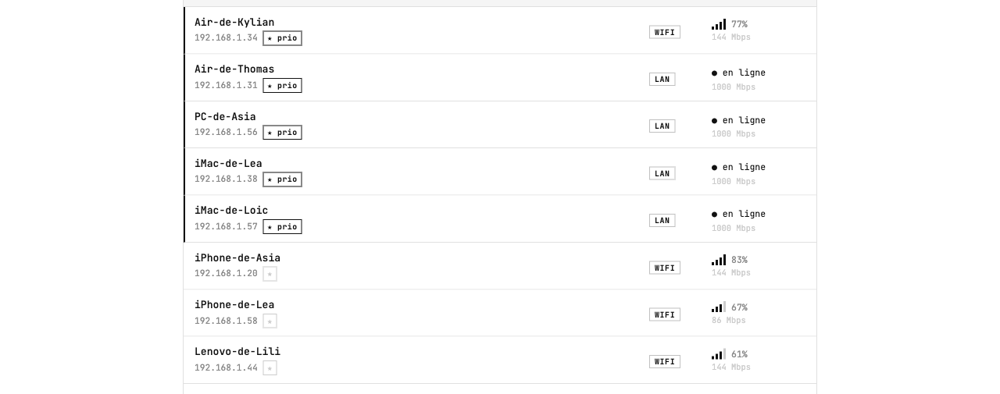

# Fritz Monitor

Dashboard web local pour surveiller les appareils connectés à une FritzBox et le débit WAN en temps réel.

 

## Screenshots

**Débit WAN en temps réel avec % d'utilisation DSL**



**Historique sparkline 3 min**



**Liste des appareils avec signal WiFi et vitesse LAN**



## Fonctionnalités

- **Débit WAN en temps réel** — download/upload réels (bytes/s via TR-064) avec barre de remplissage, % d'utilisation DSL et historique sparkline (3 min)
- **Liste des appareils** — tous les appareils du réseau (WiFi + LAN), actifs ou hors ligne
- **Signal WiFi** — indicateur 4 barres + débit négocié (Mbps)
- **Vitesse LAN** — débit négocié en Mbps pour les appareils filaires
- **Filtres** — Tous / Connectés / WiFi / LAN / Priorité
- **Renommer** — clic sur un nom d'appareil pour le renommer (sauvegardé dans la FritzBox)
- **Priorité** — bouton ★ pour activer/désactiver la priorité réseau (sauvegardé dans la FritzBox)
- Rafraîchissement automatique toutes les 3 secondes

## Prérequis

- Python 3.8+
- FritzBox avec accès TR-064 activé (activé par défaut)
- Un utilisateur FritzBox avec mot de passe (Paramètres → Système → Utilisateurs FRITZ!Box)

## Installation

```bash
# Cloner le repo
git clone https://github.com/thomasgermain93/fritz-monitor.git
cd fritz-monitor

# Installer les dépendances
pip install -r requirements.txt
```

## Configuration

Éditer les constantes en haut de `app.py` :

```python
FRITZ_IP       = '192.168.1.1'   # IP de votre FritzBox
FRITZ_USER     = 'votre_user'    # Utilisateur FritzBox
FRITZ_PASSWORD = 'votre_mdp'     # Mot de passe
REFRESH_INTERVAL = 3             # Intervalle de polling en secondes
```

## Lancement

```bash
python3 app.py
# ou
./start.sh
```

Ouvrir **http://localhost:5000** dans le navigateur.

Pour y accéder depuis un autre appareil du réseau : **http://[IP_DE_VOTRE_MAC]:5000**

## Stack technique

- **Backend** : Python / Flask — polling FritzBox toutes les 3s via TR-064 (fritzconnection)
- **Débit WAN réel** : `WANCommonIFC1/GetAddonInfos` → `NewByteReceiveRate` / `NewByteSendRate`
- **Capacité DSL** : `WANCommonIFC1/GetCommonLinkProperties` → `NewLayer1DownstreamMaxBitRate`
- **Signal WiFi** : `WLANConfiguration1/2/3` → `X_AVM-DE_GetWLANDeviceListPath`
- **Vitesse LAN/WiFi** : `X_AVM-DE_Speed` dans le hostlist TR-064
- **Frontend** : HTML/CSS/JS vanilla, JetBrains Mono, Canvas sparkline
